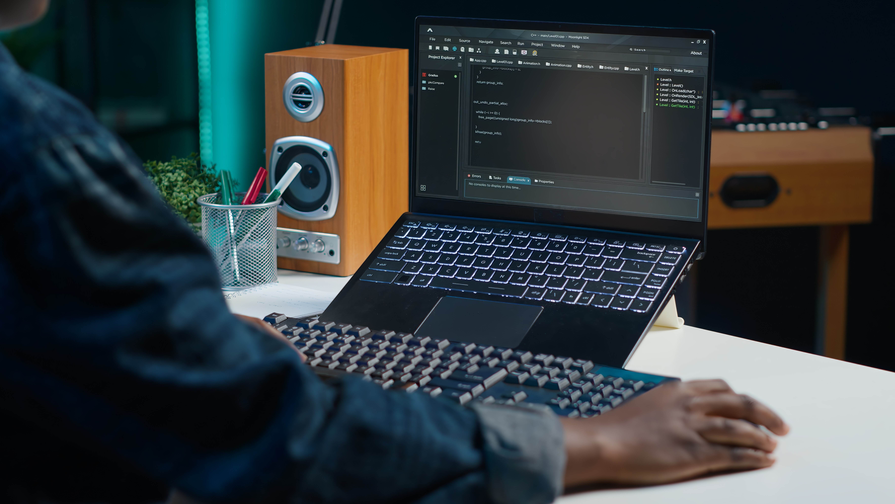

<!-- Banner -->

  

<h1 align="center">Hi, I'm Hamza AIT MANSOUR 👋</h1>

  Future Software Engineer | Backend Developer | Java & Spring Boot Enthusiast  

---

## 🚀 About Me
I'm a final-year computer engineering student at **ENSA Agadir**, passionate about:

- **Backend development**
- **Java 17 & Spring Boot**
- **Microservices architecture**
- **Cloud deployment (AWS)**
- **Docker & DevOps culture**

I'm currently seeking a **4–6 month PFE internship starting February 2026** focused on backend, cloud, or distributed systems.

---

## 🧠 Tech Stack

### 🚩 Languages

  

### ⚙️ Backend & Frameworks

  

- Spring Boot  
- Spring Security  
- Spring WebSockets  
- Spring AI  
- REST APIs  

### 🕸 Microservices & Cloud

  

- Spring Cloud (Eureka, Gateway, Config Server, Resilience4j)  
- Dockerized Services  
- AWS ECS, RDS, Amplify  
- Terraform  
- GitHub Actions (CI/CD)  

### 🗄 Databases

  

### 🛠 Tools & Methodologies
- Git & GitHub  
- Agile / Scrum  
- UML  
- Basic Networking (CCNA 1 & 2)  
- Problem-solving, teamwork, communication  

---

## 🔥 Featured Projects

| Project | Year | Description | Stack | Link |
|---------|------|-------------|--------|------|
| **Event Management App** | 2025 | Real-time events (WebSockets), recommendations (Spring AI), deployed on AWS | Spring Boot, WebSockets, Spring Security, Docker, AWS | *(link soon)* |
| **Biometric Attendance System (PFA)** | 2025 | ZK9500 fingerprint scanner integration, secure auth, AWS deployment | Spring Boot, Spring Security, AWS RDS, Docker | *(link soon)* |
| **Classroom Management System** | 2024 | JEE web app with Hibernate JPA, REST APIs | Java EE, JPA, MySQL | *(link soon)* |
| **E-commerce Website** | 2023 | Laravel e-commerce platform | Laravel, MySQL | *(link soon)* |

---

## 📊 GitHub Stats

  
  

  

---

## 🎓 Education

**ENSA Agadir — State Engineer Degree in Computer Science (2021–2026)**  
Specialization: Backend, Cloud, Software Architecture, Agile

**Certifications**  
- Java SE 17 Certified  

---

## 🎯 Internship Goal

Seeking a **PFE Internship (February 2026)** in:

- Backend / Java development  
- Microservices & Distributed Systems  
- Cloud (AWS, Docker, DevOps)  

Available for **remote or on-site opportunities**.

---

## ✨ Quote
> “The best code is the one you don’t need to explain.”

---

## 📬 Contact

| Type | Info |
|------|------|
| **Email** | hamza.aitmansour@edu.uiz.ac.ma |
| **GitHub** | [hamzaaitmansour](https://github.com/hamzaaitmansour) |
| **LinkedIn** |[hamzaaitmansour](https://www.linkedin.com/in/hamzaaitmansour/) |
| **Location** | Agadir, Morocco |

---

  Thanks for visiting! ⭐ Feel free to explore my work or reach out for collaborations.

